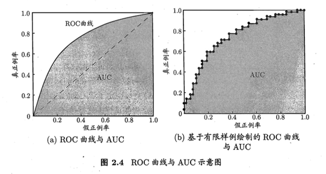

# 模型评估和选择

### 2.1 经验误差与过拟合

- 精度 = 1 - 错误率
- 学习器在训练集上的误差称为`训练误差`
- 在新样本上的误差成为`泛化误差`
- `过拟合`
- `欠拟合`

### 2.2 评估方法

##### 2.2.1 留出法

- 测试集训练集3、7分
- 常见做法是将大约2/3~4/5的样本用于训练，剩余样本用于测试

##### 2.2.2 交叉验证法

- 将数据集划分为n个大小相似的互斥子集。每次用k-1个子集的并集作为训练集，余下的那个子集作为测试集。

##### 2.2.3 自助法

- 是一种从给定训练集中有放回的均匀抽样，也就是说，每当选中一个样本，它等可能地被再次选中并被再次添加到训练集中。
- 样本在m次采样中始终不被采到的概率是$(1 - \frac{1}{m})^m$，取极限得到：$$\lim_{m \mapsto \infty } (1 - \frac{1}{m})^m \mapsto \frac{1}{e} \approx 0.368$$
- 在数据集较小、难以有效划分训练、测试集时很有用

##### 2.2.4 调参与最终模型

### 2.3 性能度量

- 性能度量就是衡量模型泛化能力的评价标准；就是把学习器预测结果与真实标记进行比较

##### 2.3.1 错误率与精度

- 对样例集$D$，分类错误率定义为$$E(f; D) = \frac{1}{m} \sum_{i = 1}^m \mathbb{I} (f(x_i) \neq y_i)$$
  - 精度则定义为$acc(f; D) = 1 - E(f; D)$
- 对于数据分布$D$和概率密度函数$P(·)$，错误率与精度可分别描述为$$E(f; D) = \int_{x \sim D} \mathbb{I} (f(x) \neq y) p(x) dx$$，$$acc(f; D) = 1 - E(f; D)$$

##### 2.3.2 查准率、查全率和F1

- 真正例 TP、假正例 FP、真反例 TN、假反例FN
- `查准率`  Precision $P = \frac{TP}{TP + FP}$
- `查全率`  Recall $R = \frac{TP}{TP + FN}$
- 平衡点 BEP 是 查准率==查全率 时的取值
- `F1度量`：$F1 = \frac{2 · P · R}{P + R} = \frac{2 · TP}{样例总数 + TP - TN}$

##### 2.3.3 ROC与AUC

- ROC 全称是“受试者工作特征”
- ROC 曲线纵轴是“真正例率”，横轴是“假正例率”
  - $TPR = \frac{TP}{TP + RN}$
  - $FTR = \frac{FP}{TN + FP}$

- 有m个点，AUC 可估算为$$AUC = \frac{1}{2} \sum_{i = 1}^{m - 1} (x_{i + 1} - x_i) · (y_i + y_{i + 1})$$

- 给定$m^+$个正例和$m^-$个反例，另$D^+$和$D^-$分别表示正、反例集合，则排序“损失”（loss）定义为$$\zeta_{rank} = \frac{1}{m^+ + m^-} \sum_{x^+ \epsilon D^+} \sum_{x^- \epsilon D^-} (\mathbb{I}(f(x^+) < f(x^-)) + \frac{1}{2} \mathbb{I} (f(x^+) = f(x^-))$$
- $$AUC = 1 - \zeta_{rank}$$

##### 2.3.4 代价敏感错误率与代价曲线

### 2.4 比较检验

##### 2.4.1 假设检验

##### 2.4.2 交叉t检验

##### 2.4.3 McNemar检验

##### 2.4.4 Friedman检验与Nemenyi后续检验

### 2.5 偏差与方差

- $E(f;D) = bias^2(x) + var(x) + \epsilon^2$，也就是说，`泛化误差可分解为偏差、方差与噪音之和`
